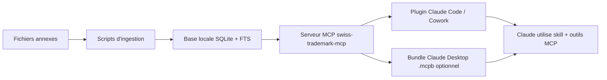

# Architecture cible

## Recommandation generale

Construire un seul serveur MCP local, read-only, specialise marques suisses, avec quatre modules internes :

1. `nice` - chapeaux Nice et WDL ;
2. `swissreg` - corpus de depots professionnels ;
3. `taf` - jurisprudence et aide a l'examen ;
4. `workflow` - prompts et ressources utiles au skill.

Le serveur MCP doit etre consomme par un plugin Claude qui contient :

- le skill `swiss-trademark-deposit` ;
- quelques commandes explicites ;
- une configuration `.mcp.json` ;
- une documentation utilisateur/developpeur.

## Principe d'architecture



## Choix technique recommande

### Runtime

Recommandation : TypeScript / Node.js.

Raisons :

- compatible avec les SDK MCP officiels ;
- simple a packager dans un plugin Claude ;
- meilleur choix pour un bundle `.mcpb`, car Claude Desktop embarque un runtime Node.js ;
- evite d'imposer Python a l'utilisateur final.

Python peut rester utilise pour l'ingestion build-time si necessaire, mais le runtime MCP livre a l'utilisateur devrait etre Node.js.

### Stockage

Recommandation : SQLite avec FTS5.

Tables proposees :

- `nice_headings`
- `wdl_terms`
- `swissreg_marks`
- `swissreg_goods_services`
- `swissreg_filter_values`
- `class_examples`
- `taf_entries`
- tables FTS associees : `wdl_terms_fts`, `swissreg_goods_fts`, `taf_entries_fts`

### Embeddings

Optionnel en v1.

Priorite v1 : recherche lexicale robuste avec FTS, normalisation accents/casse, synonymes simples. Les embeddings pourront venir ensuite pour "signes structurellement comparables" dans la jurisprudence TAF.

## Frontiere entre skill et MCP

Le skill doit contenir :

- la posture ;
- le workflow ;
- les regles de decision ;
- la facon de restituer.

Le MCP doit contenir :

- les donnees ;
- les recherches ;
- les citations ;
- les exemples ;
- les outils deterministes.

Il ne faut pas mettre la logique juridique centrale uniquement dans le MCP. Le MCP sert de memoire et de moteur de recuperation ; Claude reste responsable du raisonnement, en suivant le skill.

## Composants MCP

### Tools

Les tools sont invoques par Claude pour rechercher ou verifier :

- `nice_get_headings`
- `wdl_search_terms`
- `wdl_validate_terms`
- `swissreg_search_examples`
- `swissreg_class_combinations`
- `swissreg_mark_detail`
- `taf_search_precedents`
- `taf_get_entry`
- `corpus_stats`

### Resources

Les resources exposent des documents stables :

- `nice://headings`
- `nice://heading/{class_number}`
- `corpus://stats`
- `skill://workflow-summary`
- `source://manifest`

### Prompts

Les prompts MCP peuvent fournir des workflows explicites, mais ils sont secondaires si le plugin contient deja des commandes.

Prompts possibles :

- `prepare_trademark_deposit`
- `analyze_absolute_grounds`
- `draft_nice_goods_services`
- `prepare_manual_prior_rights_search`

## Plugin Claude cible

Structure recommandee :

```text
swiss-trademark-deposit/
  .claude-plugin/
    plugin.json
  .mcp.json
  README.md
  skills/
    swiss-trademark-deposit/
      SKILL.md
      references/
        motifs-absolus.md
        classification-nice.md
        procedure-depot.md
        recherche-anteriorite.md
  commands/
    depot-marque.md
    analyse-signe.md
    rediger-libelles.md
    recherche-anteriorite.md
  servers/
    swiss-trademark-mcp/
      package.json
      src/
      data/
        trademark.sqlite
        source-manifest.json
```

## Variante Claude Desktop `.mcpb`

Si l'objectif est une installation en un clic dans Claude Desktop, produire en plus :

```text
swiss-trademark-deposit-mcpb/
  manifest.json
  server/
    index.js
    package.json
    node_modules/
    data/
      trademark.sqlite
  icon.png
```

Le `.mcpb` doit embarquer le serveur MCP et ses dependances. Il ne remplace pas forcement le plugin Claude Code/Cowork : c'est une forme de distribution locale du serveur.

## Securite et confidentialite

- Serveur read-only en v1.
- Aucun appel reseau par defaut.
- Pas de collecte de donnees utilisateur.
- Les recherches de marques saisies par l'utilisateur restent locales.
- Si un mode mise a jour reseau est ajoute, le rendre explicite et desactive par defaut.
- Les resultats doivent toujours indiquer la source et la date du corpus.

## Integrations EUIPO optionnelles

Deux APIs officielles EUIPO sont a signaler au developpeur comme accelerateurs possibles pour une v2 connectee :

1. **Goods And Services** - `https://dev.euipo.europa.eu/product/goods-and-services_110`
   - usage potentiel : explorer la taxonomie TMClass, rechercher des produits/services, valider et traduire des classifications, recuperer les chapeaux de classes ;
   - endpoints affiches par le portail : `GET /taxonomy`, `GET /classHeadings`, `GET /terms`, `POST /terms-suggestion-list`, `POST /classification-validation`, `POST /classification-translation` ;
   - plan par defaut indique : 3000 appels/heure.

2. **Trademark search** - `https://dev.euipo.europa.eu/product/trademark-search_100`
   - usage potentiel : rechercher dans la base EUIPO et recuperer les informations disponibles sur une marque donnee ;
   - endpoints affiches par le portail : `GET /trademarks`, `GET /trademarks/{applicationNumber}`, `GET /trademarks/{applicationNumber}/image`, `GET /trademarks/{applicationNumber}/image/thumbnail`, `GET /trademarks/{applicationNumber}/sound`, `GET /trademarks/{applicationNumber}/video`, `GET /trademarks/{applicationNumber}/model`.

Recommandation d'architecture :

- garder le MCP local/offline comme socle v1 ;
- ajouter un module `euipo` optionnel, active uniquement si une cle/API subscription est configuree ;
- ne jamais presenter une recherche EUIPO comme une recherche d'anteriorite suisse complete ;
- utiliser EUIPO comme signal complementaire pour les marques de l'Union europeenne et pour les formulations TMClass, en plus des sources suisses IPI/Swissreg/WDL.
